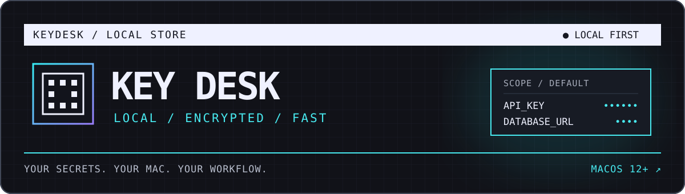
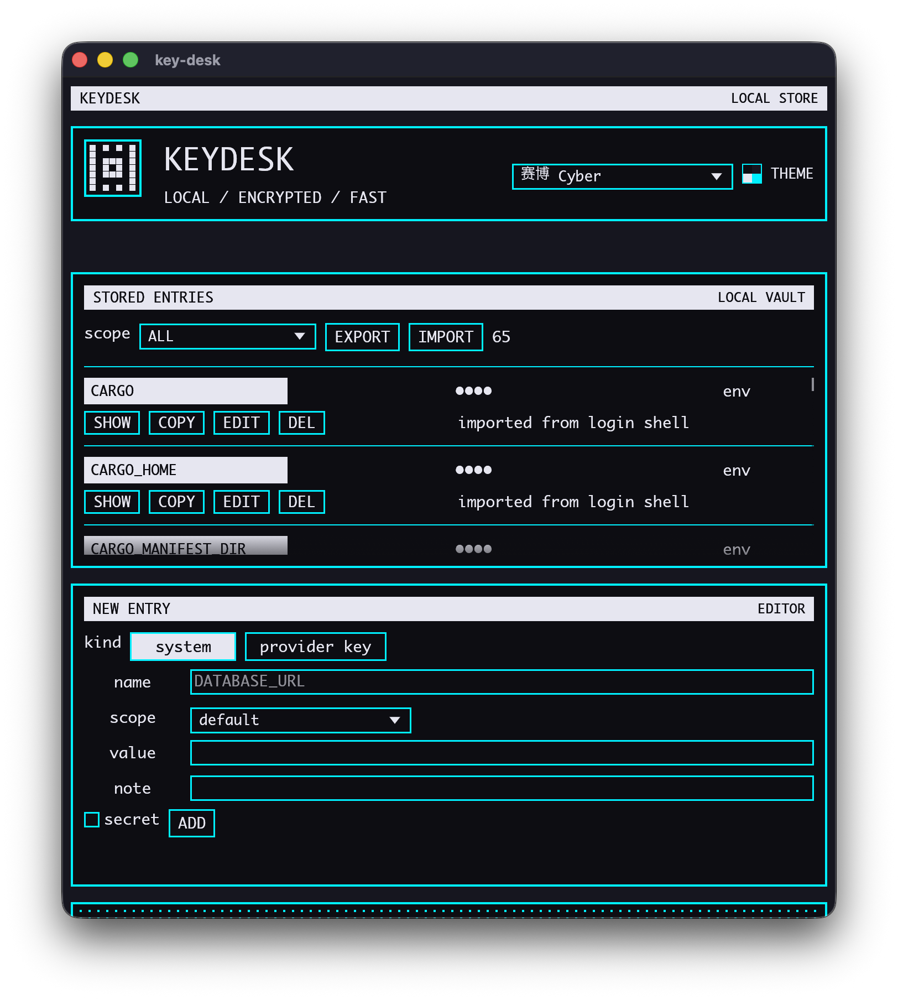

<div align="center">



### 把散落的环境变量和 API Key，收进一张本地工作台。

一款为 macOS 打造的轻量密钥管理工具。按项目整理变量，随手复制，快速拼出 `.env`。

[下载 v0.0.2](https://github.com/taylon1024/key-desk/releases/tag/v0.0.2) · [查看功能](#功能一览) · [本地开发](#本地开发)

`macOS 12+` · `Rust + egui` · `SQLite` · `AES-256-GCM`

</div>

<br>

<div align="center">
  
</div>

## 功能一览

| | 能做什么 |
| :--- | :--- |
| **集中管理** | 用 scope 区分项目或环境；新增、编辑、删除变量，同一 scope 内名称唯一。 |
| **快速取用** | 默认遮住变量值；复制单条 `KEY=value`，或把当前筛选结果复制成 `.env` 文本。 |
| **菜单栏直达** | 顶部 **KD** 菜单可复制变量，也能直接打开对应条目编辑；菜单文字不显示变量值。 |
| **从现有环境导入** | 选择当前进程或登录 shell 的环境变量，筛选后导入本地库。 |
| **LLM 服务商模板** | 为常见服务商预填变量名和 Base URL；示例 Key 只作占位提示。 |
| **个性化界面** | 13 套本地保存的配色主题。 |

## 三步开始

1. 从 [Releases 下载 v0.0.2](https://github.com/taylon1024/key-desk/releases/tag/v0.0.2)，在 macOS 12 或更新版本上安装。安装包尚未签名；首次启动请右键点击 **Key Desk**，选择“打开”。
2. 新建变量并选择 scope，或通过 **IMPORT** 从当前进程／登录 shell 导入。
3. 用 **COPY** 复制单条；筛选 scope 后用 **EXPORT** 将结果写入剪贴板，粘贴到需要的 `.env` 文件中。

> **EXPORT 只复制文本到剪贴板，不会在磁盘上创建 `.env` 文件。**

## 数据与安全

- 变量保存在本机 SQLite，值落盘时使用 **AES-256-GCM** 加密；`secret` 开关只控制界面的默认遮罩状态，所有变量值都会加密。
- 新生成的加密密钥保存在 macOS 钥匙串，不写入数据库。旧版数据库仍可读取其同名 `.key` 文件，以保留兼容性。
- 数据库和主题位于 `~/Library/Application Support/key-desk/`；可用 `KEY_DESK_DB` 指定其他数据库路径。
- 发布构建在每次启动时请求 Touch ID 或 Mac 账户密码。当前开发配置默认跳过这一步；发布模式的实机验证状态见 [开发进度](docs/DEVELOPMENT_PROGRESS.md)。

## 本地开发

需要 Rust 工具链与 macOS。仓库默认启用便于开发的 `dev` feature：

```bash
cargo run
```

按发布模式启动，启用系统身份验证：

```bash
cargo run --no-default-features
```

更多实现状态和待办见 [开发进度](docs/DEVELOPMENT_PROGRESS.md)。
